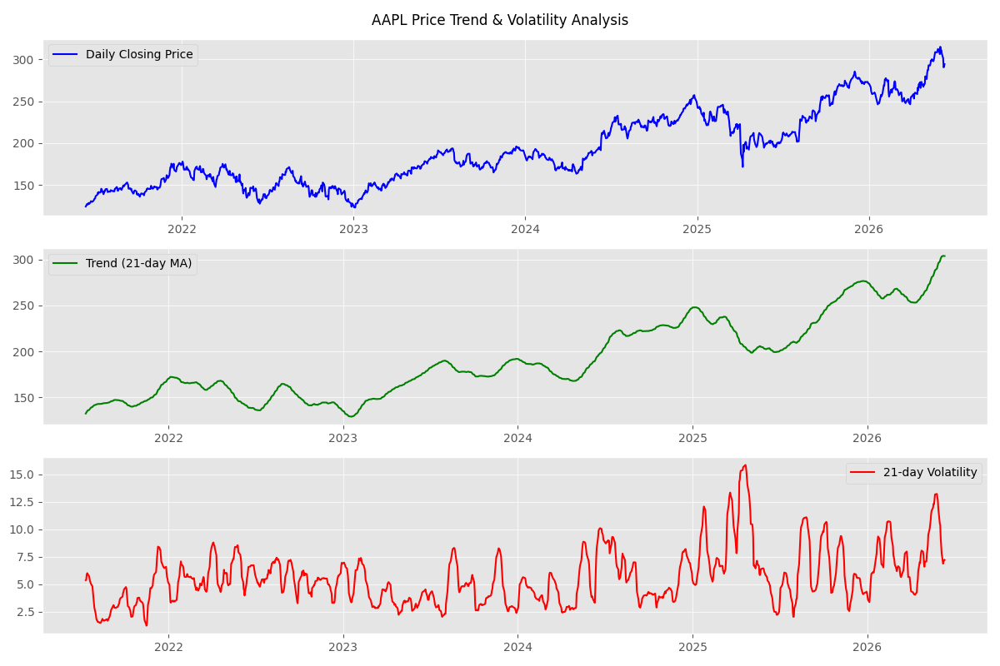
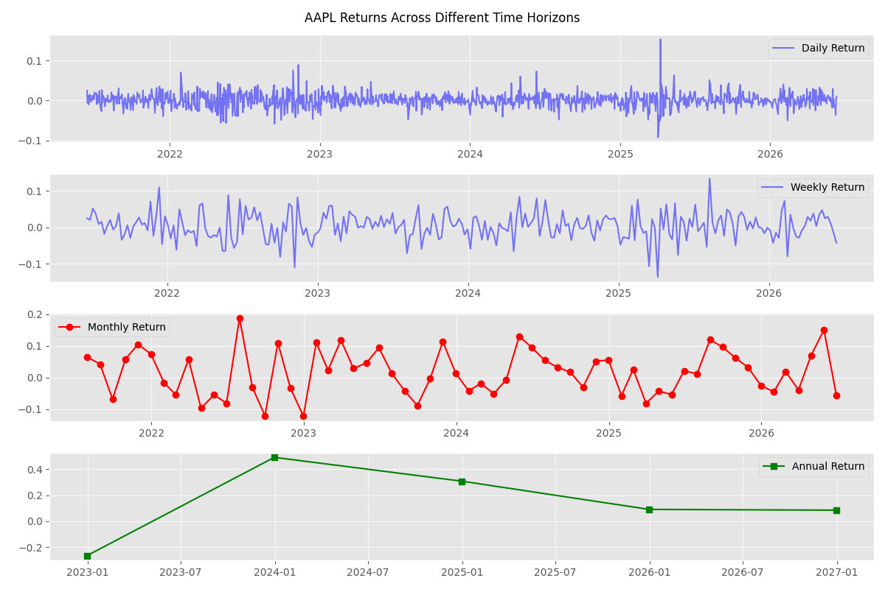
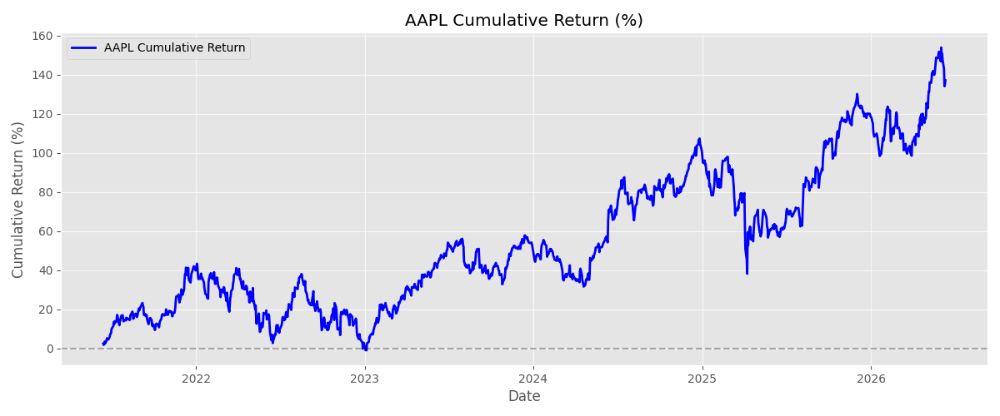

# Stock Forecast Pipeline

A containerized data pipeline that downloads stock data (AAPL, MSFT, GOOGL, JPM, SPY) from Yahoo Finance, stores it in PostgreSQL, and runs Python/SQL time-series analysis with forecasting capabilities.

## Live Demo

👉 [Click here to open the live app](https://stock-forecast-pipeline-m3b9zu9mrqn5w4t4uvfptl.streamlit.app)

## Latest Analysis





## Future Work

- ARIMA/SARIMA time series forecasting
- Compare ML models (XGBoost, Random Forest, LSTM)

## Tech

Python / PostgreSQL / Docker

## Quick Start

```bash
git clone https://github.com/aguchhait-stack/stock-forecast-pipeline.git
cd stock-forecast-pipeline
docker-compose up

# Run the dashboard
streamlit run app.py
```

## 📄 License

MIT License — free to use, modify, and distribute.

---

## 👨‍💻 Author

**Arijit Guchhait**  
[LinkedIn](https://www.linkedin.com/in/guchhaitarijit/)